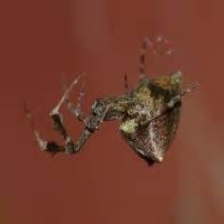
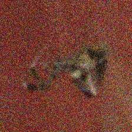
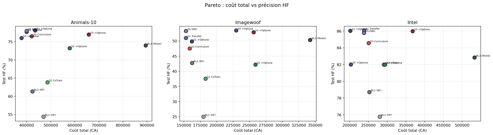

<div align="center">


# Apprentissage profond multi-fidélité

### Réduire le coût d'acquisition des données sans sacrifier la précision

*Projet **PF22** — Université de Technologie de Belfort-Montbéliard (UTBM)*

</div>

---

## 🎯 Contexte et objectif

En vision par ordinateur, acquérir des données **haute fidélité** (HF) — images nettes,
haute résolution, capteurs coûteux — est cher. Des données **basse fidélité** (BF) —
images dégradées, capteurs bon marché, simulations grossières — sont abondantes et peu
coûteuses, mais moins informatives.

> **Question du projet :** peut-on entraîner un classifieur d'images aussi précis qu'un
> modèle « tout-HF », en remplaçant la majorité des données HF par des données BF bon
> marché, grâce à des **stratégies d'entraînement multi-fidélité** ?

On simule ce cadre à partir de jeux de données HF en générant à la volée une version BF
dégradée, puis on entraîne avec un budget **10 % HF + 90 % BF**. L'évaluation se fait
toujours sur du **100 % HF** (le cas d'usage réel). Chaque méthode est jugée à la fois sur
sa **précision** et sur un **modèle de coût** explicite.

|  HF (haute fidélité)  |  BF (basse fidélité)  |
| :-------------------: | :-------------------: |
|  |  |
| 224×224 net | downscale 64 px + bruit σ=0.15 + JPEG q60 |

---

## 🔬 Méthodologie

- **Modèle :** ResNet-18 entraîné *from scratch* (AMP FP16, Adam, CrossEntropy, 20 époques).
- **3 jeux de données :** Animals-10, Imagewoof, Intel Image Classification (10 classes chacun).
- **Dégradation BF** (`src/degradation.py`) : sous-échantillonnage 224→64→224 (bilinéaire
  antialias) + bruit gaussien σ=0.15 + compression JPEG q60, appliquée **à la volée** et
  **déterministe par index**.
- **Découpe :** train = 10 % HF + 90 % BF, test = 100 % HF.
- **Modèle de coût** (`src/cost.py`) : coût d'acquisition modélisé par la résolution
  C(d) = C_min + (C_HF − C_min)·(d/224)², calibré à un **ratio 10:1** entre HF et BF.
  Trois métriques : coût des données (acquisition, unique), images vues (calcul), coût total pondéré.
- **Robustesse multi-graines :** chaque résultat est une moyenne ± écart-type sur 3 graines (42, 1, 2).

### Baselines

| Baseline | Données d'entraînement |
| --- | --- |
| **BL1 (HF)** | uniquement les 10 % HF |
| **BL2 (BF)** | uniquement les 90 % BF |
| **BL3 (Mixte)** | tout le HF + tout le BF (référence « coût maximal ») |

### Stratégies multi-fidélité

| # | Stratégie | Idée |
| --- | --- | --- |
| **S1** | Transfer learning | pré-entraînement BF, puis fine-tuning HF |
| **S2** | Co-training pondéré | batch mixte HF/BF avec pondération de la perte |
| **S3** | Curriculum | augmentation progressive de la part de HF au fil des époques |
| **S5** | EWC | régularisation *Elastic Weight Consolidation* (pénalité de Fisher) lors du passage BF→HF |

Les hyperparamètres de chaque stratégie sont optimisés par **Optuna** (TPE, 20 essais).

---

## 📊 Résultats clés

Sur **Animals-10** (précision test HF, moyenne ± écart-type ; coût total en unités CA) :

| Modèle | Précision HF | Coût total | Commentaire |
| --- | :---: | :---: | --- |
| BL1 (HF seul) | 54.3 ± 2.2 | 470 400 | peu de données → sur-apprentissage |
| BL2 (BF seul) | 61.3 ± 6.3 | 424 260 | domaine BF ≠ test HF |
| **BL3 (Mixte)** | 74.0 ± 3.0 | **894 660** | bonne précision mais **coût max** |
| **S1 Transfer** | 77.7 ± 0.6 | **400 230** | précision BL3 à **≈ ½ du coût** |
| S3 Curriculum | 76.5 ± 0.2 | 421 265 | meilleur compromis HF/BF |
| **S5 EWC** | **78.0 ± 0.3** | **400 230** | meilleure précision HF |
| S2 Co-training | 63.8 ± 5.2 | 486 720 | instable (grand écart-type) |

**À retenir :** les meilleures stratégies (**EWC ≳ Transfer > Curriculum > Co-training**)
**égalent ou dépassent** la baseline « coût maximal » BL3 tout en divisant le **coût total
par ≈ 2**, à coût d'acquisition de données identique. Les résultats sont cohérents sur les
3 jeux de données.

<div align="center">

<br/><em>Front de Pareto précision HF vs coût total — les stratégies dominent les baselines.</em>
</div>

---

## 📂 Structure du dépôt

```
.
├── README.md                     ← ce fichier
├── requirements.txt              ← dépendances Python
├── run_all.sh                    ← exécute tous les notebooks (nbconvert, tmux)
├── make_dataset_samples.py       ← génère les exemples HF/BF du rapport
│
├── src/                          ← code réutilisable
│   ├── env_config.py             ← résolution des chemins (Colab / serveur / local)
│   ├── degradation.py            ← pipeline de dégradation BF
│   ├── cost.py                   ← modèle de coût multi-fidélité
│   ├── generate_multifidelity_datasets.py
│   ├── train_baselines.py
│   └── analysis_utils.py
│
├── notebooks/                    ← pipeline complet, numéroté 01 → 45
│   ├── 01–17  préparation, baselines, S1, S2 (par dataset)
│   ├── 18–21  bilan global, robustesse, sensibilité au coût, analyse
│   ├── 22–29  S3 (Curriculum) et S5 (EWC)
│   └── 30–45  variantes Optuna
│
├── results_gpu_run/              ← SNAPSHOT FINAL des résultats (3 datasets)
│   ├── *.json                    ← métriques brutes par modèle
│   ├── analysis/                 ← CSV de synthèse + figures du rapport
│   └── comparison/               ← robustesse, sensibilité au coût
│
└── latek_report/                 ← rapport & présentation LaTeX
    ├── main.tex / main.pdf                       ← rapport complet (~60 pages)
    ├── presentation_finale_PF22.tex / .pdf       ← support de soutenance
    └── figures/                                  ← toutes les figures
```

> **Note sur les chemins :** `src/env_config.py` résout automatiquement les emplacements
> selon l'environnement. En local/serveur, les données sont attendues sous
> `data/<dataset>/processed_multifidelity/` et les sorties d'exécution sont écrites dans
> `results/` (dossier de travail, non versionné). Le dossier **`results_gpu_run/`** est le
> **snapshot figé et versionné** des résultats finaux présentés dans le rapport.

---

## 📄 Rapport et soutenance

- 📘 **Rapport complet** : [`latek_report/main.pdf`](latek_report/main.pdf)
- 🖥️ **Présentation de soutenance** : [`latek_report/presentation_finale_PF22.pdf`](latek_report/presentation_finale_PF22.pdf)

---

## ⚙️ Reproduire les expériences

### 1. Environnement

```bash
python -m venv .venv && source .venv/bin/activate   # ou conda create -n pf22 python=3.10
pip install -r requirements.txt
```

Entraînements réalisés sur GPU **NVIDIA V100S** (et sur Google Colab). L'AMP FP16 nécessite
un GPU compatible CUDA.

### 2. Données

Placer chaque jeu de données brut sous `data/<dataset>/raw/`, puis générer la découpe
multi-fidélité via les notebooks de préparation (`notebooks/01…`) ou
`src/generate_multifidelity_datasets.py`. Datasets utilisés :
[Animals-10](https://www.kaggle.com/datasets/alessiocorrado99/animals10),
[Imagewoof](https://github.com/fastai/imagenette#imagewoof),
[Intel Image Classification](https://www.kaggle.com/datasets/puneet6060/intel-image-classification).

### 3. Exécution

```bash
# Tout le pipeline (baselines + stratégies + analyses), en arrière-plan via tmux :
bash run_all.sh

# … ou notebook par notebook, dans l'ordre numérique :
jupyter notebook notebooks/
```

Les figures et CSV de synthèse sont régénérés dans `results/` puis dans
`latek_report/figures/` pour le rapport.

---

## 🧰 Stack technique

`PyTorch` · `torchvision` · `Optuna` · `Weights & Biases` · `NumPy` · `pandas` ·
`Matplotlib` · `Pillow` · Jupyter · LaTeX (rapport & Beamer).

---

## 👤 Auteur

**Ivann Vasic** — Projet PF22, UTBM, 2026.